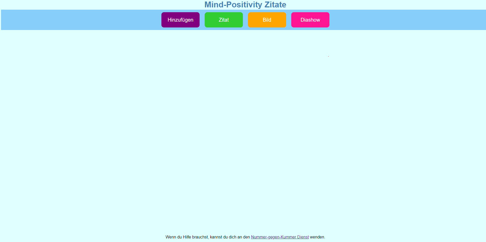
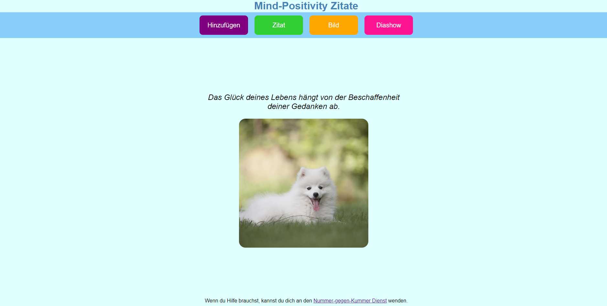
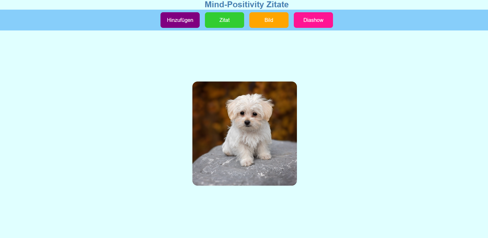
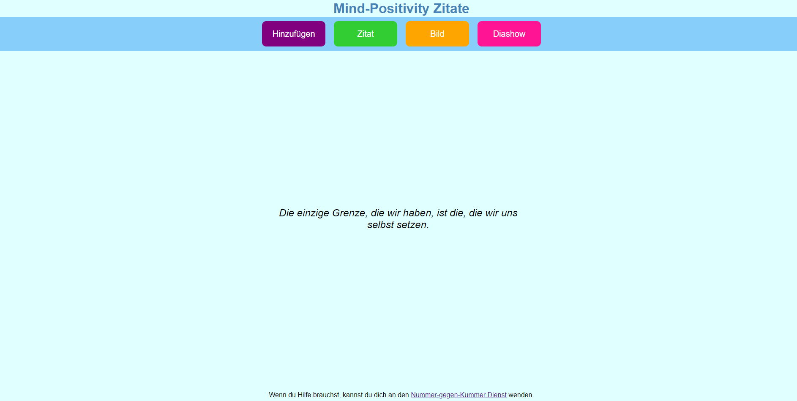
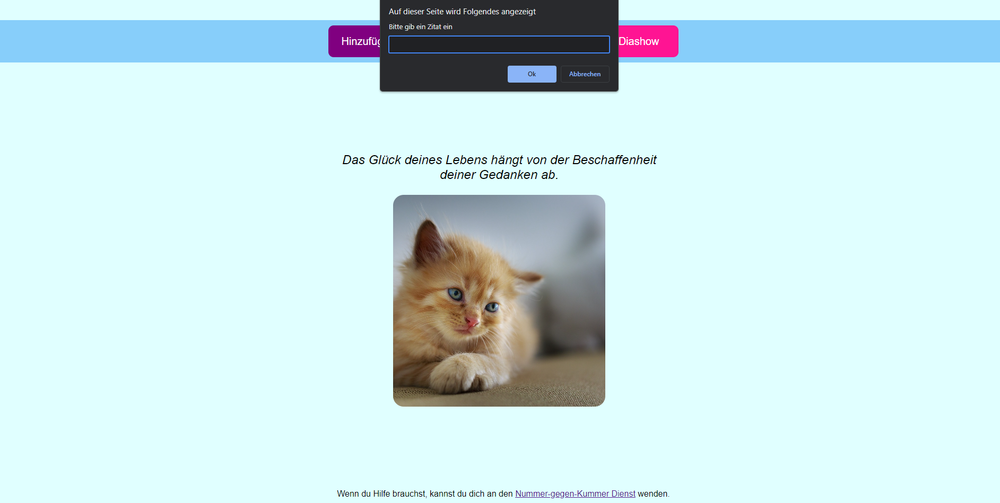

# Website zur Anzeige von Zitaten und Bildern

Kleines Webprojekt zum Experimentieren mit HTML, CSS und JavaScript, das zufällige Zitate und Bilder anzeigt. Zusätzlich bietet es eine Diashow-Funktion sowie die Möglichkeit, eigene Inhalte hinzuzufügen. Die interaktiven Funktionen wurden mithilfe von Tests validiert. 
Mithilfe von Pflichtenheft und Testdokumentation habe ich die Entwicklung transparent und nachvollziehbar dokumentiert.

## Features

- **Zufällige Zitate & Bilder**: Anzeige von Zitat- und Bild-Kombinationen, die bei jedem Klick aktualisiert werden.  
- **Diashow-Funktion**: Automatisches Durchblättern von Bildern/Zitaten in einem definierten Zeitintervall.  
- Nutzer können eigene Zitate und Bilder hinterlegen und in die Anzeige integrieren.

## Demo

  
  
    
  
  

